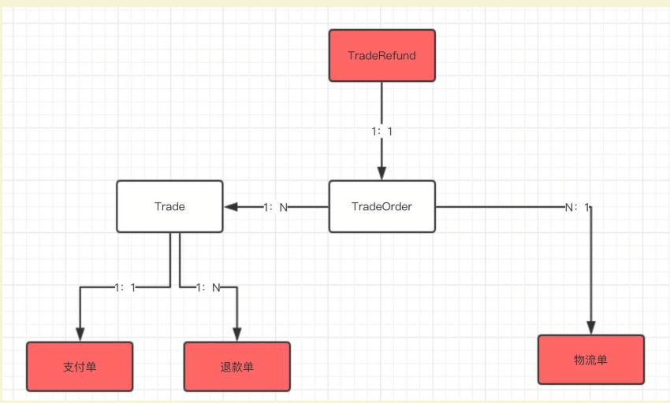

## 业务梳理

### 1.订单

有赞商城为例

1. 运营后台-订单管理-所有订单
2. 运营后台-订单管理-订单详情
3. 实体类图
   

- 本文内容
  - **Trade ：TradeOrder = 1：N 。一次交易，可以有多个交易明细（交易订单**）；一次交易，多个商家订单。
- 未来章节的内容
  - Trade ：支付单 = 1：1 。一次交易，一次支付。
  - Trade ：**退款单 = 1：N** 。一个交易明细，可以**多次**退款，所以可以有多个退款单。
  - TradeOrder ：TradeRefund = 1：1 。一个交易明细，可以发起一次退款维权。(TradeRefund  退款)
  - TradeOrder ：物流单 = N：1 。多个交易明细，可以**合并**发货。
- 有赞不存在拆单，B2C 有赞为自营平台；京东、淘宝因为有第三方商家拆掉普遍存在。