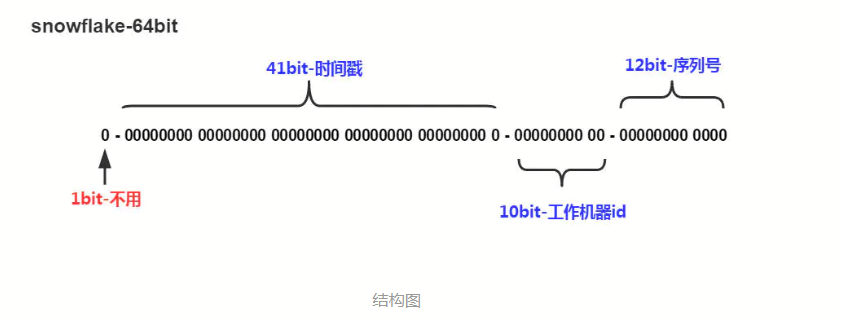

## 1.互联网算法

### 算法概述：

时间复杂度：
**O(1) < O(log2N) < O(n) < O(N \* log2N) < O(N2) < O(N3) < O(N!)**


### 1.一致性hash算法

https://segmentfault.com/a/1190000017847097

#### 学习的契机：

redis集群路由策略一致性hash环

#### 基本概念：

一种特殊的哈希算法，在移除或者添加一个服务器时，能够尽可能小地改变已存在的服务请求与处理请求服务器之间的映射关系。

#### 目的：

解决简单哈希算法在分布式[哈希表](https://baike.baidu.com/item/哈希表/5981869)( Distributed Hash Table，DHT) 中存在的**动态伸**缩等问题。

#### 条件：

平衡型、单调性、分散性

#### 场景：

分布式系统

hash值取值范围：0 - 2^32-1
**原因主流服务器为IPV4，地址长度为32**
**地址空间不同，IPv4中规定IP地址长度为32，而IPv6中IP地址的长度为128**


### 2.滑动窗口算法(sliding window algorithm)

#### 学习的契机：

1. 阿里sentinel分布式系统的流量防卫兵，源码分析
2. 面试过程中遇到求最大非重复字符问题

#### 基本概念：

滑动窗口实际上是**通过双指针实现的**，[left,right)之间的范围就是窗口（左闭，右开）。**通常用于解决字符串、数组 的 子元素相关问题**。比如最小子串等。


### 二分法查找（binary search）


### 3.整理篇

如图概述


#### 1.冒泡排序（Bubble sort）


#### 2.快速排序（Quick sort）


### 4.树算法

二叉树、AVL树、红黑树、B树、B+树的缺点优点及使用场景。

#### 1.二叉树

**定义：**

二叉查找树的特点就是**左子树的节点值比父亲节点小**，而**右子树的节点值比父亲节点大**;

**缺点：**

极端情况下，二叉树退化为近似链表；时间复杂度从O(logn)到O(n);

#### 2.平衡二叉树（AVL树）

**定义：**

具有二叉查找树的全部特性。

每个节点的**左子树和右子树的高度差至多等于1**。

**优缺点：**

虽然**平衡树解决了二叉查找树退化为近似链表的缺点**，能够把查找时间控制在 O(logn)，不过却不是最佳的，因为平衡树要求每个节点的左子树和右子树的高度差至多等于1，这个要求实在是太严了，**导致每次进行插入/删除节点的时候，几乎都会破坏平衡树的第二个规则，进而我们都需要通过左旋和右旋来进行调整**，使之再次成为一颗符合要求的平衡树。


#### 3.红黑二叉树

**定义：**

（1）**每个节点或者是黑色，或者是红色。**
（2）**根节点是黑色。**
（3）每个叶子节点（NIL）是黑色。 [注意：这里叶子节点，是指为空(NIL或NULL)的叶子节点！]
（4）**如果一个节点是红色的，则它的子节点必须是黑色的**。
（5）从一个节点到该节点的子孙节点的所有路径上包含相同数目的黑节点。[这里指到叶子节点的路径]
包含n个内部节点的红黑树的高度是 O(log(n)).


#### 4.B树

**定义：**

一棵m阶的B树的满足条件：
（1）每个节点至多有m棵子树
（2）根节点除外，其它每个分支节点至少有【m/2】棵子树
（3）根节点至少有两棵子树（除非B树只包含一个节点）
（4）所有叶子节点在同一层上，B树的叶子节点可以看成一种外部节点，不包含任何信息。
（5）有j个孩子的非叶结点恰好有j-1个关键码，关键码按递增次序排列。
B 树又叫平衡多路查找树

B树的使用场景
B树多用于做文件系统的索引。

那么问题来了：为什么要用B树，红黑树不是就挺好的么？
原因：
**B树和二叉树、红黑树相比较，子树更多也就是路数越多，子树月多表示数的高度越低，搜索效率越高。**


#### 5.B+树

**定义：**
（1）有 k 个子树的中间节点包含有 k 个元素（B 树中是 k-1 个元素），**每个元素不保存数据，只用来索引**，所有数据
都保存在叶子节点。
（2）所有的叶子结点中包含了全部元素的信息，及指向含这些元素记录的指针，且叶子结点本身依关键字的大小
**自小而大**顺序链接。
（3）所有的中间节点元素都同时存在于子节点，在子节点元素中是最大（或最小）元素。

**B+树的使用场景**
B+树是在B树的基础上进行改造的，他的数据都在叶子节点，同时叶子节点之间还加了指针形成链表。
**B+树多用于数据库中的索引**。

那么为什么B+树用于数据库中的索引呢？
原因：
因为在数据库中select常常不只是查询一条记录，常常要查询多条记录。比如：按照id的排序的后10条。如果是多条的话，B树需要做中序遍历，可能要跨层访问。而B+树由于所有数据都在叶子结点，不用跨层，同时由于有链表结构，只需要找到首尾，通过链表就能够把所有数据取出来了。


### 5.跳跃表

**定义：**

(1) 由很多层结构组成

(2) **每一层都是一个有序的链表**

(3) **最底层(Level 1)的链表包含所有元素**

(4) **如果一个元素出现在 Level i 的链表中，则它在 Level i 之下的链表也都会出现。**

(5) **每个节点包含两个指针，一个指向同一链表中的下一个元素，一个指向下面一层的元素。**

**常用比较**
skiplist和各种平衡树（如AVL、红黑树等）的元素是有序排列的，而哈希表不是有序的。因此，在哈希表上只能做单个key的查找，不适宜做范围查找。所谓范围查找，指的是查找那些大小在指定的两个值之间的所有节点。

在做范围查找的时候，平衡树比skiplist操作要复杂。在平衡树上，我们找到指定范围的小值之后，还需要以中序遍历的顺序继续寻找其它不超过大值的节点。如果不对平衡树进行一定的改造，这里的中序遍历并不容易实现。而在skiplist上进行范围查找就非常简单，只需要在找到小值之后，对第1层链表进行若干步的遍历就可以实现。

平衡树的插入和删除操作可能引发子树的调整，逻辑复杂，而skiplist的插入和删除只需要修改相邻节点的指针，操作简单又快速。

从内存占用上来说，skiplist比平衡树更灵活一些。一般来说，平衡树每个节点包含2个指针（分别指向左右子树），而**skiplist每个节点包含的指针数目平均为1/(1-p)，具体取决于参数p的大小**。如果像Redis里的实现一样，取p=1/4，那么平均每个节点包含1.33个指针，比平衡树更有优势。

查找单个key，skiplist和平衡树的时间复杂度都为O(log n)，大体相当；而哈希表在保持较低的哈希值冲突概率的前提下，查找时间复杂度接近O(1)，性能更高一些。所以我们平常使用的各种Map或dictionary结构，大都是基于哈希表实现的。

从算法实现难度上来比较，skiplist比平衡树要简单得多。


### 6.贪心算法

又称贪婪算法，是指在对问题求解时，总做出在当前看来是最好的选择；也就是说不从整体最好上加以考虑，算法得到的是某种意义上的局部最优解。

步骤：

1. 建立数学模型来描述问题；
2. 把求解的问题分成若干个子问题；
3. 对每个子问题求解，得到子问题的局部最优解；
4. 把子问题的局部最优解合成为原问题的一个解。

算法特点：

1. 自定向下，以迭代方式做出相继的贪心选择；


### 7.SnowFlake算法

- 分布式id的生产方法众多，今天讲解Twitter的SnowFlake算法；生产一个64bit大小整数id。
- 算法原理图：



1. **1bit**，不用，因为二进制中最高位是符号位**，1表示负数，0表示正数**。生成的id一般都是用整数，所以最高位固定为0。
2. **41bit-时间戳**，用来记录时间戳，毫秒级。
    \- 41位可以表示个数字，
    \- 如果只用来表示正整数（计算机中正数包含0），可以表示的数值范围是：0 至 ，减1是因为可表示的数值范围是从0开始算的，而不是1。
    \- 也就是说41位可以表示个毫秒的值，转化成单位年则是%20%2F%20(1000%20*%2060%20*%2060%20*%2024%20*365)%20%3D%2069)年
3. **10bit-工作机器id**，用来记录工作机器id。
    \- 可以部署在个节点，包括5位datacenterId和5位workerId
    \- 5位（bit）可以表示的最大正整数是，即可以用0、1、2、3、....31这32个数字，来表示不同的datecenterId或workerId
4. **12bit-序列号**，序列号，用来记录同毫秒内产生的不同id。
    \-  12位（bit）可以表示的最大正整数是，即可以用0、1、2、3、....4094这4095个数字，来表示同一机器同一时间截（毫秒)内产生的4095个ID序号。

由于在Java中64bit的整数是long类型，所以在Java中SnowFlake算法生成的id就是long来存储的。


### 8.动态规划算法

- 三要素
  - 重叠子问题：
  - 最优子结构：
  - 状态转移方程：


## 2.算法基础

### 1.算法概述

#### 1.时间复杂度

大O表示法

O(1)<O(logn)<O(n)<O(nlogn)<O(n^2)<O(n^3)....

#### 2.空间复杂度

同样大O表示法

中间态临时数据所占空间;

### 2.数据结构基础

#### 1.array


#### 2.linked list


#### 3.栈和队列

可用数组或者链表实现栈和队列

- stack FILO(First in Last out): 
  jdk官方工具类：java.util.Stack用java.util.Vector实现该部分,Obectj数组组成对应元素，push正序插入数组，pop方法倒序去除；从而实现Stack。
- queue FIFO(First in First out)

#### 4.散列表


### 3.树

定义：树是n（n>=0）个节点的有限集。当n=0时，为空树。在任意非空树中，有如下特点。

- 有且仅有一个根节点
- 当n>1时，其余节点可分为m(m>0)个互不相交的有限集，每一个集合本身又是一个树，并称为根的子树。

#### 1.什么是二叉树

二叉树即binary tree；

- 满二叉树：所有分支都是满的。
- 完全二叉树：只要最后一个节点之前节点都是齐全即可。

#### 2.二叉树的遍历

##### 1.为什么要研究遍历

- 二叉树为非线性
- 4种遍历方式：前三种为深度优先遍历，4为广度优先遍历
  1. 前序遍历:根，左，右
  2. 后序遍历:左，根，右
  3. 中序遍历:左，右，根
  4. 层序遍历：
- 二叉搜索树（Binary Search Tree）
  - 

#### 3.二叉堆


#### 4.优先队列


### 4.排序算法

#### 1.冒泡排序 Bubble sort


#### 2.快速排序


## 3.计算机基础

### 1.补码

负数的二级制表示用补码来表示

```shell
#补码 = 反码+1
#补码 = (原码-1)再取反
```


